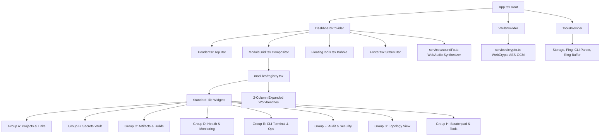

# ⚡ 000-Mission-Control (000-Dashboard)

> **High-Density Cyberpunk Mission Control & SRE Command Deck for Distributed Cloud Infrastructure, Zero-Knowledge Secrets Management, Real-time Observability, and Operations Automation.**

[](https://react.dev/)
[](https://www.typescriptlang.org/)
[](https://vitejs.dev/)
[](https://developer.mozilla.org/en-US/docs/Web/API/Web_Crypto_API)
[](https://developer.mozilla.org/en-US/docs/Web/API/Web_Audio_API)
[](LICENSE)

---

## 📑 Оглавление / Table of Contents

- [1. О проекте (Overview)](#1-о-проекте-overview)
- [2. Ключевые возможности (Key Features)](#2-ключевые-возможности-key-features)
- [3. Архитектура системы (System Architecture)](#3-архитектура-системы-system-architecture)
- [4. Каталог 70 модулей (70-Module Catalog)](#4-каталог-70-модулей-70-module-catalog)
- [5. Безопасность и Zero-Knowledge Vault (Security Model)](#5-безопасность-и-zero-knowledge-vault-security-model)
- [6. Синтезатор звуковых эффектов WebAudio (Sound Engine)](#6-синтезатор-звуковых-эффектов-webaudio-sound-engine)
- [7. Горячие клавиши и управление (Keyboard Shortcuts)](#7-горячие-клавиши-и-управление-keyboard-shortcuts)
- [8. Темы оформления и плотность UI (Design System & Themes)](#8-темы-оформления-и-плотность-ui-design-system--themes)
- [9. Быстрый старт и локальный запуск (Quick Start)](#9-быстрый-старт-и-локальный-запуск-quick-start)
- [10. Структура репозитория (Project Structure)](#10-структура-репозитория-project-structure)
- [11. Дополнительная документация (Deep Dives)](#11-дополнительная-документация-deep-dives)

---

## 1. О проекте (Overview)

**000-Mission-Control** — это специализированная консоль управления и операционный командный пункт (Command Deck), разработанный для разработчиков, SRE, DevOps и SecOps инженеров. 

Панель объединяет управление инфраструктурой, мониторинг доступности сервисов, зашифрованное хранилище секретов с нулевым разглашением (Zero-Knowledge AES-256), журнал аудита, интерактивный CLI-терминал и плавающий набор утилит в едином сверхплотном TUI/GUI интерфейсе.

### Главные инженерные принципы:
1. **Zero External Assets (100% автономность)**: Все иконки, шрифтовые моно-сетки и звуковые эффекты (WebAudio) синтезируются кодом в реальном времени. Нет тяжелых картинок, внешних аудиофайлов или шрифтовых задержек.
2. **Deterministic Bounded Viewport (TUI Grid)**: Интерфейс никогда не «плывёт» и не порождает нежелательный глобальный скролл страницы. Каждый тайл строго изолирован (`min-height: 0`, `overflow: hidden`) со своим внутренним скролл-буфером.
3. **Multi-Column Tiling Compositor**: Поддержка динамических сеток (1, 2, 3, 4 колонки), режима Master-Stack (DWM/Xmonad style), горизонтальных полос и двухуровневого зума (Compact Tile ↔ Fullscreen 2-Column Inspector Workbench).
4. **Client-Side Zero-Knowledge Encryption**: Ключи шифруются по стандарту AES-GCM 256-bit на стороне браузера (PBKDF2 100 000 итераций). Никакой открытый текст никогда не утекает во внешние логи.

```
+---------------------------------------------------------------------------------------------------+
| 000 // COMMAND DECK  [000.localhost:3000]  LAYOUT: [GRID(3)] [MASTER] [ROWS]  DEFCON: [1][2][3][4][5]    |
+---------------------------------------------------------------------------------------------------+
|  [A1] PROJECT TABLE        |  [B1] SECRETS VAULT (AES)  |  [D1] HEALTH MATRIX (SLA 99.98%)      |
|  - 000 Gateway       8ms   |  - PROD_STRIPE_KEY  [Copy] |  - Cloud Run Ingress    24ms ▂▃▅▆▇    |
|  - Cloud Run Core    24ms  |  - SUPABASE_SERVICE [Mask] |  - Gemini API Gateway   34ms ▂▃▅▆▇    |
|  - Gemini AI Engine  34ms  |  - GITHUB_DEPLOY_KEY[Copy] |  - Postgres Cloud SQL   14ms ▂▃▅▆▇    |
+----------------------------+----------------------------+---------------------------------------+
|  [E1] CLI TERMINAL (ROOT)  |  [F1] SYSTEM AUDIT STREAM  |  [H2] MARKDOWN SCRATCHPAD IDE         |
|  000:~# ping 000.localhost |  14:02:11 [DEPLOY] Staging |  # 000 Mission Notes                  |
|  latency=8.1ms loss=0%     |  14:01:45 [VAULT] Key Cop  |  - Zero-knowledge AES active          |
|  000:~# _                  |  14:00:22 [DEFCON] Level 5 |  - SLA nominal                        |
+---------------------------------------------------------------------------------------------------+
| [F9] Layouts & Themes | [F8] Modules (6/70) | [F1-F4] Cols | [~] Quick Tool Bubble | [Ctrl+K] Search |
+---------------------------------------------------------------------------------------------------+
```

---

## 2. Ключевые возможности (Key Features)

- **🖥️ Dynamic Multi-Layout Engine**:
  - **Tiling Grid**: 1, 2, 3 или 4 колонки с автоматическим распределением строк.
  - **Master-Stack (DWM)**: Главный инспектор слева (1.3fr) + стек вспомогательных панелей справа.
  - **Horizontal Rows**: Линейный поток тайлов для широких мониторов.
  - **Expand / Zoom Workbench**: Двойной клик на шапку или кнопка `🗖 EXPAND` разворачивает любой виджет в полноэкранный 2-колоночный рабочий верстак (Workbench) с инспектором, метриками и кнопками быстрых операций (Runbooks).

- **🔐 Zero-Knowledge Cryptographic Vault**:
  - WebCrypto AES-GCM 256-bit + PBKDF2 (100,000 rounds SHA-256).
  - Маскировка значений (`••••••••••••••••`), 1-click копирование в буфер обмена с мгновенным звуковым подтверждением.
  - Визуальный эффект *«Matrix Decryption Scramble»* при открытии ключа (перебор глифов `0123456789ABCDEF$#%*@&~+=-_/?!§`).
  - Встроенный генератор криптографической энтропии (Hex, Base64, Alphanumeric).

- **📊 Реестр проектов и Observability**:
  - Таблица сервисов с отслеживанием окружений (Production, Staging, Dev, Infra, Internal).
  - Живой мониторинг Health Matrix с микрографиками Latency Sparklines (` ▂▃▅▆▇`), процентом аптайма 24h SLA и RTT.
  - Синтетический HTTP/TLS пинг-тестер любого произвольного URL.

- **💻 Интерактивный CLI-терминал**:
  - Встроенный эмулятор командной строки с поддержкой команд: `help`, `status`, `ping <host>`, `defcon <1-5>`, `deploy <env>`, `add <module_id>`, `clear`.
  - Панель макро-триггеров (Purge CDN Cache, Run Diagnostics, Deploy Pipelines).

- **⚡ Плавающий HUD Toolkit (`~` / Backquote)**:
  - Моментальный выдвижной инструментарий:
    1. **Ping Tester**: Синтетическая проверка доступности эндпоинтов.
    2. **Token Gen**: Генератор токенов заданной длины и типа.
    3. **SHA Verifier**: Сверка SHA-256 контрольных сумм релизных артефактов.
    4. **Base64**: Быстрый двусторонний кодер/декодер строк.
    5. **JSON**: Валидатор и форматировщик структурированных объектов.

- **🔍 Global Spotlight Command Palette (`Ctrl+K`)**:
  - Мгновенный fuzzy-поиск по всем проектам, ключам, артефактам, эндпоинтам и быстрым действиям с навигацией клавишами `↑`/`↓`/`Enter`.

- **🛡️ DEFCON Defense Matrix (Levels 1–5)**:
  - Глобальное переключение уровней боеготовности системы (от DEFCON 5 «Nominal» до DEFCON 1 «Maximum Lockdown» со звуковой тревогой).

- **💾 Memory Slots & Persistence**:
  - Все состояния (активные модули, раскладка, тема, плотность, заметки, логи) мгновенно сохраняются в `localStorage`.
  - 3 независимых пользовательских слота памяти для быстрого сохранения и загрузки конфигураций рабочего пространства.

---

## 3. Архитектура системы (System Architecture)

Проект построен по модульной архитектуре с чётким разделением ответственности:



### Слои приложения:
1. **Context & State Layer (`src/context/`)**:
   - [`DashboardContext`](file:///home/mx/000/src/context/DashboardContext.tsx): Управляет раскладками, списком активных модулей, DEFCON, темой, плотностью и слотами сохранения.
   - [`VaultContext`](file:///home/mx/000/src/context/VaultContext.tsx): Управляет состоянием мастер-пароля, расшифровкой ключей, буфером обмена и анимацией раскодирования.
   - [`ToolsContext`](file:///home/mx/000/src/context/ToolsContext.tsx): Управляет историей терминала, блокнотом, кольцевым буфером логов и тулбоксом.
2. **Module Registry & Catalog (`src/services/moduleCatalog.ts`, `src/modules/registry.tsx`)**:
   - Реестр 70 модулей с метаданными и 2-уровневым рендерингом (компактный виджет или расширенный верстак).
3. **Services Layer (`src/services/`)**:
   - [`crypto.ts`](file:///home/mx/000/src/services/crypto.ts): WebCrypto (AES-GCM, PBKDF2, SHA-256).
   - [`soundFx.ts`](file:///home/mx/000/src/services/soundFx.ts): WebAudio генератор тонов и аккордов.
   - [`initialData.ts`](file:///home/mx/000/src/services/initialData.ts): Начальный датасет сервисов, секретов, артефактов и логов.
4. **Hooks Layer (`src/hooks/`)**:
   - [`useKeyboardShortcuts.ts`](file:///home/mx/000/src/hooks/useKeyboardShortcuts.ts): Глобальные перехватчики клавиатуры.
   - [`useSystemClock.ts`](file:///home/mx/000/src/hooks/useSystemClock.ts): Высокоточные тики системного времени (UTC / Local).

---

## 4. Каталог 70 модулей (70-Module Catalog)

Модули каталога сгруппированы в **9 тематических групп (A–I)**:

| Группа | Название | Кол-во | Примеры ключевых модулей |
|---|---|:---:|---|
| **Group A** | Проекты и сервисы | 7 | `A1` Project Table, `A2` Project Cards, `A3` Starred, `A4` Quick Links Dock, `A5` Service Registry, `A6` Dependency Map, `A7` Env Switcher |
| **Group B** | Секреты и Credentials | 8 | `B1` Secrets Vault (AES-256), `B2` Vault Status Metric, `B3` Expiring Keys Alert, `B4` Key Generator, `B5` Vault Backup Export/Import, `B6` Clipboard Guard, `B7` .env Variables, `B8` SSH Key Ring |
| **Group C** | Артефакты и релизы | 7 | `C1` Artifacts Registry, `C2` Latest Release Card, `C3` Docker Image Tags, `C4` SSL/TLS Certs Monitor, `C5` SHA-256 Hash Verifier, `C6` Config Snapshots, `C7` DB Backups |
| **Group D** | Мониторинг и Health | 8 | `D1` Health Matrix (Live Ping), `D2` Uptime SLA Metric (99.98%), `D3` Latency Sparklines, `D4` Instant Ping Tester, `D5` Status Page Bar, `D6` Incident Log, `D7` HTTP Codes, `D8` DNS Resolution |
| **Group E** | Операции и автоматизация | 8 | `E1` Interactive CLI Terminal, `E2` Quick Runbooks, `E3` Webhook Dispatcher, `E4` Curl Command Builder, `E5` Cron Schedule Table, `E6` Deploy History, `E7` Feature Flags, `E8` Maintenance Window |
| **Group F** | Аудит и безопасность | 7 | `F1` System Audit Log Stream, `F2` DEFCON Defense Control, `F3` Access Audit Ledger, `F4` Active Sessions Manager, `F5` Security Score Matrix, `F6` IP Allowlist, `F7` 2FA Auth Status |
| **Group G** | Визуализация и инфра | 6 | `G1` Interactive Cyber Topology Canvas, `G2` ASCII Network Topology, `G3` Resource Usage (CPU/RAM), `G4` Cloud Billing Tracker, `G5` Cloud Region Map, `G6` Container Cluster Status |
| **Group H** | Инфо и утилиты | 10 | `H1` System UTC/Local Clock, `H2` Terminal Scratch Notepad IDE, `H3` Custom Bookmarks, `H4` Subdomain 000 Router Info, `H5` JSON Formatter, `H6` Base64 Tool, `H7` Text Diff, `H8` Countdown Timer, `H9` Changelog, `H10` Markdown Previewer |
| **Group I** | Каналы и нотификации | 5 | `I1` Live Alert Stream, `I2` Telegram Bot Notifier, `I3` Slack Webhook Gateway, `I4` SMTP Email Alert Rules, `I5` External Status RSS Feeds |

> 📖 Подробное описание каждого модуля доступно в документе [docs/MODULES_CATALOG.md](file:///home/mx/000/docs/MODULES_CATALOG.md).

---

## 5. Безопасность и Zero-Knowledge Vault (Security Model)

Хранилище секретов работает исключительно в оперативной памяти браузера и локальном хранилище в зашифрованном виде:

```
[Пользователь] ──(Мастер-пароль)──> [PBKDF2 DeriveKey: 100k итераций, SHA-256]
                                                   │
                                                   ▼
[Открытый секрет] <──[AES-GCM-256 Decrypt] <── [CryptoKey + Salt + IV]
```

- **Алгоритм**: `AES-GCM` с длиной ключа `256 бит`.
- **Вывод ключа**: `PBKDF2` с `100,000` итераций хеширования `SHA-256` и криптографической солью (16 байт).
- **Инициализирующий вектор (IV)**: 12 байт криптографически стойких случайных данных (`crypto.getRandomValues`) на каждую операцию шифрования.
- **Формат зашифрованного пакета**:
  ```json
  {
    "version": 1,
    "salt": "a4f891b2c4e5...",
    "iv": "3d91e847c2...",
    "ciphertext": "89f1ab34cd..."
  }
  ```
- **Защита буфера**: Автоматическое скрытие скопированных данных и сброс индикатора через 1.5 секунды.

---

## 6. Синтезатор звуковых эффектов WebAudio (Sound Engine)

Интерфейс оснащен низколатентным генератором звуковых эффектов в стиле киберпанк/ретро-терминала:
- **Zero Assets**: 0 KB скачиваемых MP3/WAV файлов.
- **Синтезируемые сигналы**:
  - `playClick(pitch)`: Мягкий синусоидальный щелчок с экспоненциальным затуханием (40мс).
  - `playCopy()`: Двухтоновый аккорд (Sine 980Hz + Triangle 1470Hz) для подтверждения копирования.
  - `playUnlock()`: Мажорный кибер-арпеджио-аккорд (C5, E5, G5, C6) при разблокировке хранилища.
  - `playLock()`: Нисходящая пилообразная волна (Sawtooth 450Hz → 110Hz).
  - `playAlarm()`: Пульсирующий сигнал тревоги DEFCON 1 (Sawtooth 800Hz ↔ 400Hz).
  - `playDeploySuccess()`: Четырехнотный триумфальный аккорд (A4, C#5, E5, A5) при успешном деплое/срабатывании ранбука.
- Переключатель `[SFX] / [MUTE]` в правом верхнем углу позволяет мгновенно отключить или включить звук.

---

## 7. Горячие клавиши и управление (Keyboard Shortcuts)

| Горячая клавиша | Действие | Описание |
|---|---|---|
| <kbd>Ctrl</kbd> + <kbd>K</kbd> / <kbd>Cmd</kbd> + <kbd>K</kbd> | **Spotlight Search** | Открыть универсальную строку поиска по проектам, секретам, артефактам и действиям |
| <kbd>F8</kbd> | **Module Catalog** | Открыть менеджер 70 модулей с возможностью выбора пресетов |
| <kbd>F9</kbd> | **Layout & Themes** | Открыть диалог настройки колонок, тем оформления, плотности и слотов |
| <kbd>F1</kbd> | **1-Column Grid** | Переключить сетку в одноколоночный режим |
| <kbd>F2</kbd> | **2-Column Grid** | Переключить сетку в двухколоночный режим |
| <kbd>F3</kbd> | **3-Column Grid** | Переключить сетку в трехколоночный режим (по умолчанию) |
| <kbd>F4</kbd> | **4-Column Grid** | Переключить сетку в четырехколоночный режим |
| <kbd>`</kbd> / <kbd>~</kbd> (Backquote) | **Quick Tool Bubble** | Открыть/скрыть плавающее меню быстрых инструментов (Ping, Gen, Hash, B64, JSON) |
| <kbd>Esc</kbd> | **Escape / Restore** | Закрыть открытые модальные окна или вернуть развернутый верстак в обычный тайл |
| **Double Click** (Шапка тайла) | **Zoom Workbench** | Развернуть модуль в полноэкранный 2-колоночный инспектор |
| <kbd>◀</kbd> / <kbd>▶</kbd> (Кнопки шапки) | **Reorder Tiles** | Переместить тайл влево/вправо в общем потоке сетки |

---

## 8. Темы оформления и плотность UI (Design System & Themes)

Доступны 4 темы люминофора и 2 режима плотности:

### Цветовые палитры:
1. **🔵 Cyber Cyan (Default)**: Тёмный индиго-сланец (`#05070a`), неоновый циановый акцент (`#38bdf8`), изумрудный (`#4ade80`), янтарный (`#facc15`).
2. **🟢 Matrix Phosphor Green**: Глубокий черный фон (`#020603`), фосфорный матричный зелёный (`#00ff66`), изумрудные границы (`#0e3015`).
3. **🟠 Retro CRT Amber**: ЭЛТ-монохром теплый янтарь (`#ffb000`), темный фон нагретого кинескопа (`#060402`).
4. **⚪ Monochrome Minimal**: Высококонтрастный технический монохромный режим в оттенках серого.

### Режимы плотности (UI Density):
- **Standard (11px)**: Оптимален для ноутбуков и рабочих станций (padding 4-8px).
- **TUI Nano (9.5px)**: Максимальная плотность для больших мониторов и экранов NOC/дежурных центров (padding 1.5-3px, компактные шапки 20px).

---

## 9. Быстрый старт и локальный запуск (Quick Start)

### Системные требования:
- **Node.js**: `v18.0.0` или выше (рекомендуется LTS 20+)
- **NPM**: `v9.0.0` или выше

### Установка и запуск:

```bash
# 1. Клонирование репозитория
git clone https://github.com/3030202/000.git
cd 000

# 2. Установка зависимостей
npm install

# 3. Запуск dev-сервера (с привязкой ко всем интерфейсам 0.0.0.0:3000)
npm run dev

# 4. Сборка production-бандла с проверкой TypeScript типов
npm run build
```

После запуска интерфейс доступен по адресу:
- 🌐 `http://localhost:3000`
- 🌐 `http://000.localhost:3000` *(современные браузеры Chrome/Edge автоматически резолвят `*.localhost` на `127.0.0.1`)*

### Привязка локального поддомена `000.localhost` (Windows PowerShell):
Для ручной прописи DNS-записей в hosts на Windows предусмотрен скрипт:
```powershell
# Запуск от имени Администратора:
powershell -ExecutionPolicy Bypass -File .\scripts\setup-hosts.ps1
```

---

## 10. Структура репозитория (Project Structure)

```
000/
├── docs/                               # Полный комплект технической документации
│   ├── ARCHITECTURE.md                 # Глубокий анализ архитектуры и потоков данных
│   ├── MODULES_CATALOG.md              # Спецификация всех 70 модулей (Group A-I)
│   └── API_AND_DATA_SPEC.md            # Спецификация типов, API и структур данных
├── scripts/
│   └── setup-hosts.ps1                 # Скрипт конфигурации локальных поддоменов
├── src/
│   ├── components/                     # Компоненты приложения
│   │   ├── layout/                     # Базовый каркас интерфейса
│   │   │   ├── Header.tsx              # Верхняя статусная панель и DEFCON контроллер
│   │   │   ├── ModuleGrid.tsx          # Tiling композитор сетки тайлов
│   │   │   ├── FloatingTools.tsx       # Плавающий HUD тулбокс (Ping/Gen/Hash/B64/JSON)
│   │   │   └── Footer.tsx              # Нижняя строка состояния и подсказки клавиш
│   │   ├── SpotlightModal.tsx          # Универсальный поиск Ctrl+K
│   │   ├── ModulePickerModal.tsx       # Каталог и селектор 70 модулей (F8)
│   │   ├── LayoutProfilesModal.tsx     # Настройки сетки, тем, плотности и слотов (F9)
│   │   └── MasterPasswordModal.tsx     # Диалог разблокировки Zero-Knowledge Vault
│   ├── context/                        # Провайдеры React Context
│   │   ├── DashboardContext.tsx        # Глобальное состояние раскладки, темы, модулей
│   │   ├── VaultContext.tsx            # Состояние шифрования, мастер-ключа и маскировки
│   │   └── ToolsContext.tsx            # Состояние терминала, блокнота, логов и утилит
│   ├── hooks/                          # Пользовательские React хуки
│   │   ├── useKeyboardShortcuts.ts     # Обработчик глобальных горячих клавиш
│   │   └── useSystemClock.ts           # Высокоточный таймер UTC/Local времени
│   ├── modules/                        # Реализация виджетов по группам
│   │   ├── groupA/                     # Проекты, ссылки и верстак инспектора
│   │   ├── groupB/                     # Секреты, генераторы и верстак ключей
│   │   ├── groupC/                     # Артефакты, хэши и реестр релизов
│   │   ├── groupD/                     # Мониторинг, метрики SLA и Health верстак
│   │   ├── groupE/                     # Интерактивный CLI терминал и макросы
│   │   ├── groupF/                     # Журнал аудита и уровни DEFCON
│   │   ├── groupG/                     # ASCII и сетевая топология
│   │   ├── groupH/                     # Markdown блокнот и утилиты
│   │   └── registry.tsx                # Центральный реестр сопоставления виджетов
│   ├── services/                       # Сервисы и движки
│   │   ├── crypto.ts                   # WebCrypto AES-GCM-256 + PBKDF2
│   │   ├── soundFx.ts                  # WebAudio генератор звуков
│   │   ├── moduleCatalog.ts            # Описание 70 модулей каталога
│   │   └── initialData.ts              # Начальный датасет (проекты, ключи, эндпоинты)
│   ├── types/                          # TypeScript интерфейсы и типы
│   │   └── index.ts                    # Единый реестр типов данных
│   ├── App.tsx                         # Корневой композитор с провайдерами
│   ├── main.tsx                        # Точка входа React 19
│   └── index.css                       # CSS-движок TUI тем, плотности и сеток
├── design_system.md                    # Спецификация дизайн-системы
├── task.md                             # Журнал задач проекта
├── walkthrough.md                      # Журнал выполненных шагов и верификаций
├── package.json                        # Манифест зависимостей и скриптов
├── tsconfig.json                       # Конфигурация компилятора TypeScript
└── vite.config.ts                      # Конфигурация сборщика Vite
```

---

## 11. Дополнительная документация (Deep Dives)

Для детального ознакомления с технической реализацией обратитесь к специализированным документам:

- 📐 **[docs/ARCHITECTURE.md](file:///home/mx/000/docs/ARCHITECTURE.md)** — Подробный разбор архитектуры, потоков данных, работы TUI-композитора, WebCrypto шифрования и WebAudio синтезатора.
- 🗂️ **[docs/MODULES_CATALOG.md](file:///home/mx/000/docs/MODULES_CATALOG.md)** — Полный каталог всех 70 модулей (коды, назначения, типы виджетов, режимы расширенного инспектора).
- 🧬 **[docs/API_AND_DATA_SPEC.md](file:///home/mx/000/docs/API_AND_DATA_SPEC.md)** — Спецификация типов данных, формата зашифрованных полезных нагрузок, CLI команд и схемы хранилища `localStorage`.

---

## 📄 Лицензия & Авторство

- **Проект**: `000-Mission-Control`
- **Версия**: `v1.0.0` / `Kernel v2.6.4-prod`
- **Репозиторий**: [https://github.com/3030202/000](https://github.com/3030202/000)
- Разработано для обеспечения максимальной скорости и безопасности работы операционных команд.
