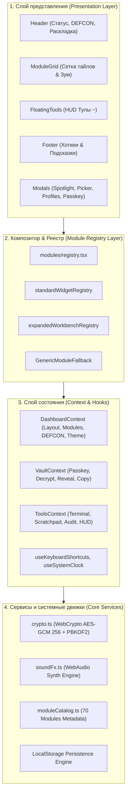

# 🏛️ Архитектурная спецификация: 000-Mission-Control

Данный документ содержит исчерпывающее техническое описание архитектуры, потоков данных, криптографических механизмов, аудио-синтезатора и подсистем рендеринга проекта **000-Mission-Control**.

---

## 📑 Содержание

1. [Обзор слоёв архитектуры (Layered Architecture)](#1-обзор-слоёв-архитектуры-layered-architecture)
2. [Декомпозиция состояния (Context & State Management)](#2-декомпозиция-состояния-context--state-management)
3. [TUI-композитор и модель вёрстки (TUI Compositor & Viewport Isolation)](#3-tui-композитор-и-модель-вёрстки-tui-compositor--viewport-isolation)
4. [Модель двухуровневого рендеринга (2-Tier Widget & Workbench Engine)](#4-модель-двухуровневого-рендеринга-2-tier-widget--workbench-engine)
5. [Криптографическая подсистема Zero-Knowledge Vault](#5-криптографическая-подсистема-zero-knowledge-vault)
6. [Синтезатор звуковых эффектов WebAudio](#6-синтезатор-звуковых-эффектов-webaudio)
7. [Подсистема горячих клавиш и глобальных событий](#7-подсистема-горячих-клавиш-и-глобальных-событий)
8. [Схема персистентности и слоты памяти (Persistence & Slots)](#8-схема-персистентности-и-слоты-памяти-persistence--slots)
9. [Руководство по расширению (Extensibility Guide)](#9-руководство-по-расширению-extensibility-guide)

---

## 1. Обзор слоёв архитектуры (Layered Architecture)

Приложение построено по принципу строгой изоляции слоев:



---

## 2. Декомпозиция состояния (Context & State Management)

Глобальное состояние разбито на 3 независимых провайдера для предотвращения каскадных ре-рендеров:

### 2.1. `DashboardContext` ([`DashboardContext.tsx`](file:///home/mx/000/src/context/DashboardContext.tsx))
Управляет визуальной конфигурацией и глобальными данными:
- **Раскладка**: `layoutStyle` (`'grid' | 'master' | 'rows'`), `colsMode` (`1 | 2 | 3 | 4`), `density` (`'standard' | 'nano'`), `theme` (`'cyber' | 'matrix' | 'amber' | 'mono'`).
- **Модули**: `activeModuleIds` (список отображаемых модулей), `zoomedModuleId` (активный развернутый верстак или `null`).
- **DEFCON & SFX**: `defcon` (`1..5`), `soundOn` (`boolean`).
- **Слоты**: `handleSaveSlot(slotNum)`, `handleLoadSlot(slotNum)`.
- **Сущности**: `projects`, `secrets`, `artifacts`, `healthEndpoints`, `quickActions`.

### 2.2. `VaultContext` ([`VaultContext.tsx`](file:///home/mx/000/src/context/VaultContext.tsx))
Управляет безопасностью и состоянием секретов:
- `isVaultUnlocked`: Флаг разблокировки мастер-паролем (`admin000` по умолчанию).
- `revealedSecrets`: Словарь `Record<string, boolean>` открытых/замаскированных ключей.
- `animatingSecrets`: Временное состояние Matrix Scramble анимации для каждого ключа.
- `copiedKeyId`: ID последнего скопированного ключа для отображения статуса `OK!`.
- Методы: `handleToggleReveal`, `handleCopySecret`, `generateRandomKey`, `unlockVault`, `lockVault`.

### 2.3. `ToolsContext` ([`ToolsContext.tsx`](file:///home/mx/000/src/context/ToolsContext.tsx))
Управляет оперативными инструментами:
- **Аудит**: `auditLogs` (кольцевой буфер на 50 записей), метод `addLog(action, details, level)`.
- **Блокнот**: `notepadText` с автоматической синхронизацией в `000_notepad`.
- **Терминал**: `termHistory`, `termInput`, парсер команд `handleTermSubmit`.
- **Плавающий тулбокс**: `isBubbleOpen`, `bubbleTool`, методы для Ping, Token Gen, SHA Verifier, Base64, JSON Inspector.

---

## 3. TUI-композитор и модель вёрстки (TUI Compositor & Viewport Isolation)

Главная инженерная проблема дашбордов — неконтролируемый скролл и поломка высоты сетки при наполнении таблиц данными.

### 3.1. Принцип фиксированного вьюпорта (Deterministic Viewport Bounds)
1. **Корень (`.app-root`)**: Занимает ровно `100vw × 100vh` с `overflow: hidden`.
2. **Шапка (`.top-bar`)**: Фиксированная высота `26px`, `flex-shrink: 0`.
3. **Подвал (`.status-bar`)**: Фиксированная высота `22px`, `flex-shrink: 0`.
4. **Рабочая область (`.workspace-grid`)**: Занимает остаточную высоту `calc(100vh - 48px)` с `min-height: 0`.

### 3.2. Изоляция тайлов (`.pane-tile`)
Каждый тайл внутри CSS Grid содержит:
```css
.pane-tile {
  display: flex;
  flex-direction: column;
  height: 100%;
  min-height: 0;      /* Предотвращает раздувание grid-ячейки дочерними элементами */
  overflow: hidden;
}

.pane-body {
  flex: 1;
  overflow-y: auto;   /* Независимый внутренний скроллбар для каждого виджета */
  overflow-x: auto;
  min-height: 0;
}
```

### 3.3. Режимы сетки:
- **Tiling Grid (`.layout-grid`)**: Равномерные колонки через `grid-template-columns: repeat(N, 1fr)`.
- **Master-Stack (`.layout-master`)**: `grid-template-columns: 1.3fr 1fr;`. Первый модуль занимает всю высоту левой колонки (`grid-row: 1 / -1`), а остальные модули размещаются в стеке справа.
- **Horizontal Rows (`.layout-rows`)**: Одноколоночный вертикальный поток широких тайлов с `grid-auto-rows: minmax(180px, 1fr)`.

---

## 4. Модель двухуровневого рендеринга (2-Tier Widget & Workbench Engine)

Каждый модуль может быть представлен в двух режимах:

```
+------------------------------------+
|  [A1] PROJECT TABLE                |  <--- Compact Mode (Обычный тайл сетки)
|  Status | Project | Env | RTT      |
+------------------------------------+
                 │
           Double Click / [EXPAND]
                 ▼
+------------------------------------------------------------------------+
|  [A1] PROJECTS EXPANDED WORKBENCH                                      |
|  +------------------------+------------------------------------------+ |
|  | LEFT: Services List    | RIGHT: Deep Inspector Pane               | |
|  | - 000 Gateway     8ms  | • Status: OPERATIONAL                    | |
|  | - Cloud Run Core 24ms  | • RTT: 8ms | TLS 1.3 | Replicas 3/3      | |
|  | - Gemini Engine  34ms  | • Runbooks: [Deploy] [Logs] [Purge]      | |
|  |                        | • Live Curl Runner & Output Console      | |
|  +------------------------+------------------------------------------+ |
+------------------------------------------------------------------------+
```

### Реализация в [`src/modules/registry.tsx`](file:///home/mx/000/src/modules/registry.tsx):
- `standardWidgetRegistry`: Карта компактных компонентов виджетов (`A1`, `A4`, `B1`, `C1`, `D1`, `E1`, `F1`, `G2`, `H2`).
- `expandedWorkbenchRegistry`: Карта полноэкранных двухколоночных верстаков (`A1`, `B1`, `D1`, `E1`, `H2`).
- Функция `renderModuleContent(modId, isZoomed)`: Проверяет флаг `isZoomed` и отрисовывает либо верстак, либо компактный виджет, либо безопасный фолбэк `GenericModuleFallback`.

---

## 5. Криптографическая подсистема Zero-Knowledge Vault

Реализована в [`src/services/crypto.ts`](file:///home/mx/000/src/services/crypto.ts) на базе стандарта **W3C Web Cryptography API**:

### 5.1. Вывод ключа (Key Derivation):
```typescript
PBKDF2 (
  password: strToBuf(masterPassword),
  salt: crypto.getRandomValues(new Uint8Array(16)),
  iterations: 100000,
  hash: 'SHA-256'
) => AES-GCM 256-bit CryptoKey
```

### 5.2. Шифрование и дешифрование:
- **Шифрование (`encryptData`)**: Генерирует уникальный 12-байтный IV, шифрует открытый текст и возвращает сериализованный JSON (`version`, `salt`, `iv`, `ciphertext` в hex-формате).
- **Дешифрование (`decryptData`)**: Восстанавливает CryptoKey по переданному паролю и соли, затем расшифровывает ciphertext с использованием IV.

### 5.3. Эффект Matrix Scramble Reveal:
При открытии ключа запускается интервальный цикл (5 кадров с интервалом 50мс), который подставляет случайные символы глифов:
```typescript
const GLYPHS = '0123456789ABCDEF$#%*@&~+=-_/?!§';
```
Это создает кинематографичный киберпанк-эффект «подбора/расшифровки» ключа.

---

## 6. Синтезатор звуковых эффектов WebAudio

Реализован в [`src/services/soundFx.ts`](file:///home/mx/000/src/services/soundFx.ts) в виде синглтона `SoundEffectsEngine`:

- **Ленивая инициализация**: `AudioContext` создается при первом взаимодействии пользователя (согласно политикам безопасности современных браузеров).
- **Осцилляторы**:
  - `playClick(pitch)`: `Sine` осциллятор с экспоненциальным сбросом частоты `pitch -> pitch * 0.5` за 40 мс.
  - `playCopy()`: Синхронный запуск двух осцилляторов (`Sine` 980 Гц + `Triangle` 1470 Гц) со сдвигом 30 мс.
  - `playUnlock()`: Полифонический мажорный аккорд `[523.25, 659.25, 783.99, 1046.5]` (ноты C5, E5, G5, C6).
  - `playLock()`: Нисходящая пилообразная волна `Sawtooth` (450 Гц → 110 Гц, 180 мс).
  - `playAlarm()`: Пилообразный двухтоновый сигнал тревоги (800 Гц ↔ 400 Гц, 300 мс).
  - `playDeploySuccess()`: Восходящий арпеджио-аккорд `[440, 554.37, 659.25, 880]` (A4, C#5, E5, A5).

---

## 7. Подсистема горячих клавиш и глобальных событий

Хук [`useKeyboardShortcuts.ts`](file:///home/mx/000/src/hooks/useKeyboardShortcuts.ts) слушает событие `window.addEventListener('keydown')`:

- `Ctrl+K` / `Cmd+K`: Тоггл модального окна `SpotlightModal`.
- `Escape`: Если активен `zoomedModuleId` — восстанавливает нормальный размер тайла. Если открыт плавающий HUD (`isBubbleOpen`) — закрывает его.
- `` ` `` / `~`: Тоггл плавающего инструментария `FloatingTools`.
- `F1`–`F4`: Мгновенное переключение количества колонок сетки (1..4) в режиме `grid`.
- `F8`: Открытие каталога 70 модулей (`ModulePickerModal`).
- `F9`: Открытие настроек тем оформления, плотности и слотов (`LayoutProfilesModal`).

---

## 8. Схема персистентности и слоты памяти (Persistence & Slots)

Все пользовательские настройки сохраняются в браузере через `localStorage`:

| Ключ | Тип данных | Назначение |
|---|---|---|
| `000_active_modules` | `string[]` (JSON) | Список ID отображаемых модулей (например `["A1", "B1", "D1", ...]`) |
| `000_layout_style` | `'grid' \| 'master' \| 'rows'` | Активный стиль композитора |
| `000_cols` | `number` (`1..4`) | Число колонок в режиме grid |
| `000_density` | `'standard' \| 'nano'` | Режим плотности шрифта и отступов |
| `000_theme` | `'cyber' \| 'matrix' \| 'amber' \| 'mono'` | Цветовая тема люминофора |
| `000_notepad` | `string` | Содержимое Markdown блокнота |
| `000_audit_logs` | `AuditLog[]` (JSON) | Последние 50 записей журнала аудита |
| `000_slot_1`, `2`, `3` | `Object` (JSON) | Пользовательские снапшоты (модули + раскладка + тема + плотность) |

---

## 9. Руководство по расширению (Extensibility Guide)

### Как добавить новый виджет:

1. **Создайте компонент виджета**:
   В соответствующей директории `src/modules/group{A..I}/MyNewWidget.tsx`:
   ```tsx
   import React from 'react';
   import { useDashboard } from '../../context/DashboardContext';

   export const MyNewWidget: React.FC = () => {
     const { projects } = useDashboard();
     return <div>{/* Ваш кастомный интерфейс */}</div>;
   };
   ```

2. **(Опционально) Создайте полноэкранный верстак (Workbench)**:
   ```tsx
   export const MyNewExpandedWorkbench: React.FC = () => {
     return (
       <div className="workbench-split">
         <div className="workbench-left">{/* Левая колонка */}</div>
         <div className="workbench-right">{/* Правая колонка */}</div>
       </div>
     );
   };
   ```

3. **Зарегистрируйте виджет в [`src/modules/registry.tsx`](file:///home/mx/000/src/modules/registry.tsx)**:
   ```tsx
   import { MyNewWidget, MyNewExpandedWorkbench } from './groupX/MyNewWidget';

   export const standardWidgetRegistry: Record<string, React.FC> = {
     // ...
     X1: MyNewWidget,
   };

   export const expandedWorkbenchRegistry: Record<string, React.FC> = {
     // ...
     X1: MyNewExpandedWorkbench,
   };
   ```

4. **Добавьте метаданные в [`src/services/moduleCatalog.ts`](file:///home/mx/000/src/services/moduleCatalog.ts)**:
   ```typescript
   { 
     id: 'X1', 
     code: 'X1', 
     name: 'My New Module', 
     group: 'X. МОЙ РАЗДЕЛ', 
     groupId: 'X', 
     widgetType: 'Таблица', 
     description: 'Описание модуля' 
   }
   ```
Новый модуль автоматически появится в каталоге (F8), поиске (Ctrl+K), пресетах и CLI-терминале (`add X1`).
